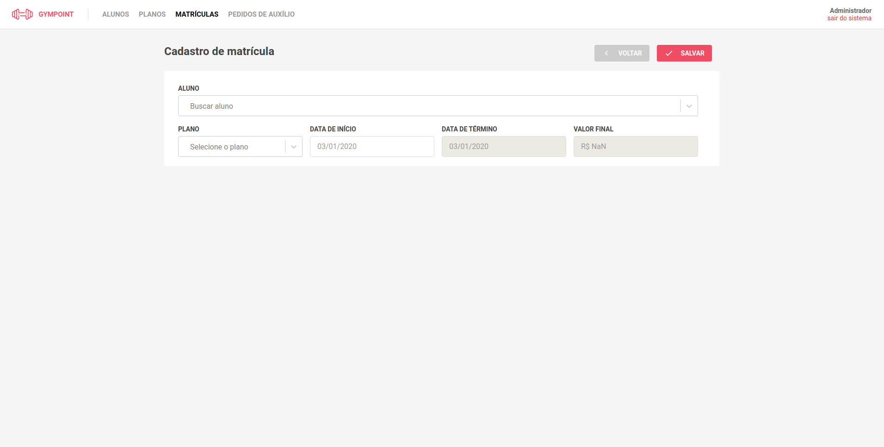

GymPoint
==============
Sistema para gestão de academias, onde que, a academia pode fazer o cadastro e matricula de seus alunos. E os alunos podem fazer checkins e tirar duvidas atraves do app.

Projeto para certicação do <a hrfe="https://rocketseat.com.br/bootcamp">bootcamp</a> da Rocketseat.

### Instalação

Abaixo segue os repositorios que compoem a plataforma GymPoint, dentro de cada repositorio existe um REDME contendo o passo a passo para a instalação.

1. <a href="https://github.com/julianosirtori/GymPoint-BackEnd">BackEnd</a>
2. <a href="https://github.com/julianosirtori/GymPoint-FrontEnd">FrontEnd</a>
3. <a href="https://github.com/julianosirtori/GymPoint-Mobile">App Android</a>

## Screenshots
FrontEnd:

App:

